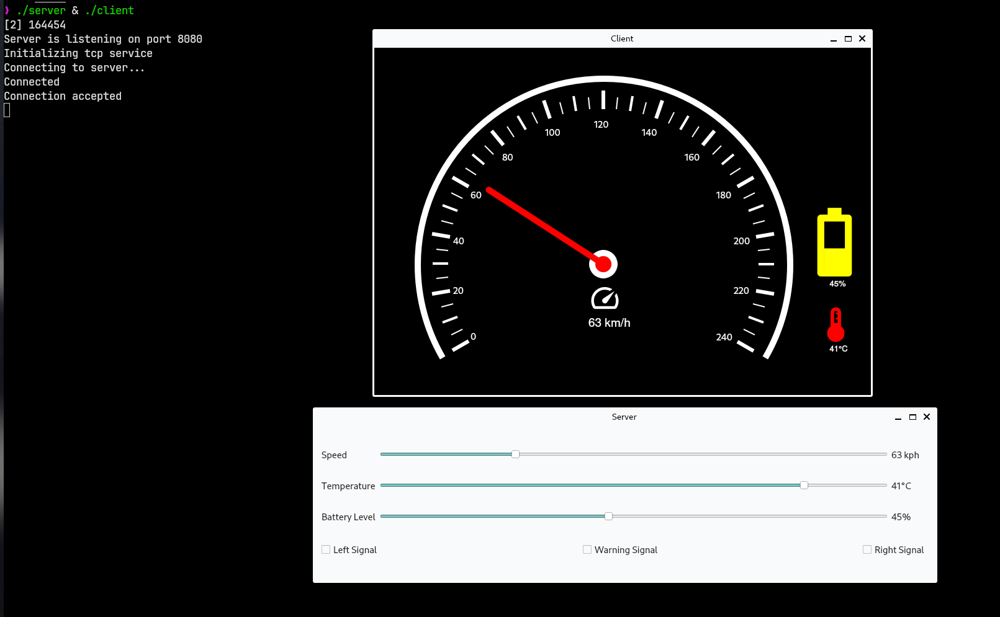
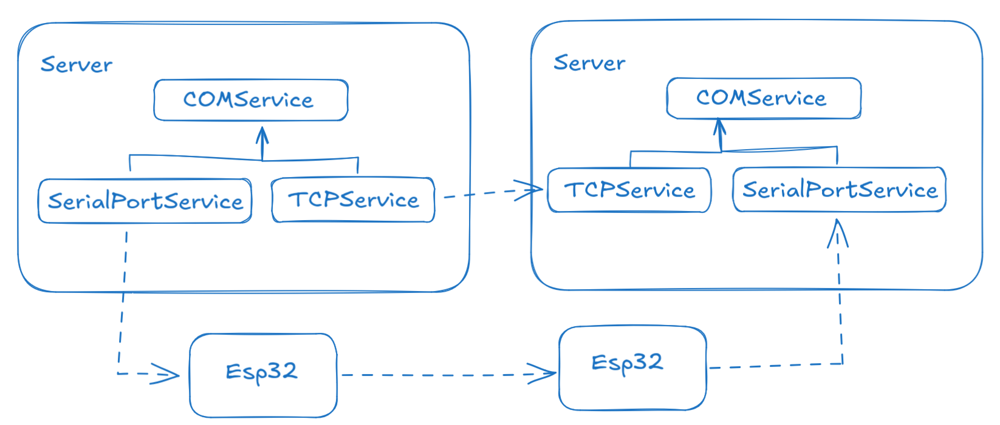

# Speedometer



A speedometer build with Qt.



This project can be compiled to either send the signals via TCP or, UART/CAN and 2 ESP32's.

To build
```shell
cmake -B build -S .
```
```shell
cd build && make
```
Use the use_tcp target to compile for tcp.
```shell
make use_tcp
```
Use the use_can target to compile for can & uart.
```shell
make use_can
```
